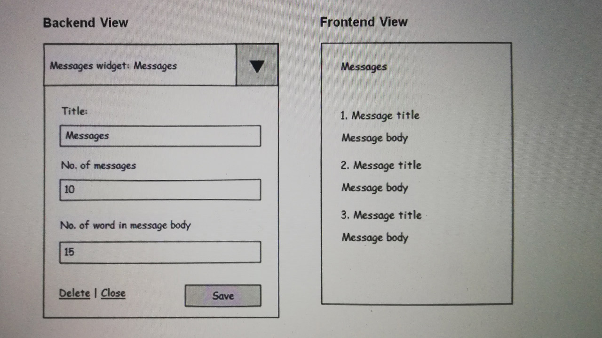

## Practical Test - WordPress Developer (3 Hours)

#### Section 02:

In this section you need to develop a plugin which create a custom widget in the back-end. This widget display the featured posts in the front-sidebar. The post information are available in the API provided. API documentation can be found in the next page. 

1. The user should be able to control the following settings from the backend.
    1. No of posts showing in the front-end.
    2. Front end widget title.
    3. No of words to show in the message body. (if message is longer than this, should be denoted with "..."

2. The title and message should be formated as shown below.



### Messages API Documentation

This API returns a collection of messages in json format. This API call will return 100 messages.

GET [http://jsonplaceholder.typicode.com/posts](http://jsonplaceholder.typicode.com/posts)

#### Example Output
```
[
  {
    "userId": 1,
    "id": 1,
    "title": "sunt aut facere repellat provident occaecati excepturi optio reprehenderit",
    "body": "quia et suscipit\nsuscipit recusandae consequuntur expedita et cum\nreprehenderit molestiae ut ut quas totam\nnostrum rerum est autem sunt rem eveniet architecto"
  },
  {
    "userId": 1,
    "id": 2,
    "title": "qui est esse",
    "body": "est rerum tempore vitae\nsequi sint nihil reprehenderit dolor beatae ea dolores neque\nfugiat blanditiis voluptate porro vel nihil molestiae ut reiciendis\nqui aperiam non debitis possimus qui neque nisi nulla"
  }
]
```

### Guidelines

1. Always use native WordPress API methods when available.

2. Do not use any prebuilt plugins or themes except CSS frameworks such as Twitter Bootstrap.

3. Please follow the WordPress best practices & coding standards.

4. We expect well-designed and clean code. Identify the issue. Remove all unwanted/unused codes (Testing and Debug codes).

5. Use proper naming convention throughout. Use meaningful names that convey the purpose of the variables. Choose names that are easy to pronounce, and avoid cryptic abbreviations.

6. Documentation and comments should be included as appropriate. Comments are structured as sentences with proper grammar and punctuation and without spelling mistakes. If time is a constraint, provide at least one sample section.

7. We evaluate your knowledge of PHP with proper coding standards. Make sure to follow good programming logic with best practices wherever possible.

8. Don't ignore and suppress errors. Make sure they don't happen in the first place.

9. Ensure that when applying these coding standards that they are applied consistently.

